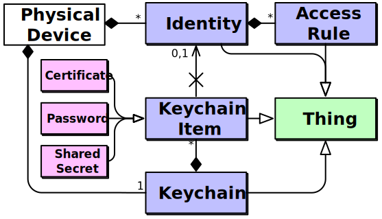

# Architecture #

The key takeaways from the diagram above are:

*   Each *device* has...
    *   ...a *[Keychain][]*, which manages *Keychain Items*.
    *   ... a set of *[Identities][]*, which have *Access Rules*.
*   A *Keychain Item* can be either a *shared secret*, *password*, or
    *certificate*.
*   The *Keychain*, *Keychain Items*, *Identities*, and *Access Rules*
    are all *[Things][]*, and can be managed in-band.
*   *Keychain Items* can optionally reference a single *Identity*.

## Layer Security Protocols ##

While technically an implementation detail, the Splot Security Model
was written with two security layer protocols in mind:
[DTLS][] and [OSCORE][].

[Things]: ../som/things.md
[Identities]: identities.md
[Keychain]: keychain.md
[DTLS]: https://tools.ietf.org/html/rfc6347
[OSCORE]: https://tools.ietf.org/html/rfc8613

[DTLS][] is intended to be used for security sessions authenticated with
certificates or low-entropy passwords (supporting monitoring/control
and initial commissioning). [OSCORE][] is intended to be used to secure
device-to-device interactions with high-entropy shared secrets. [OSCORE][]
is supported specifically to enable secure multicast device-to-device
interactions.
