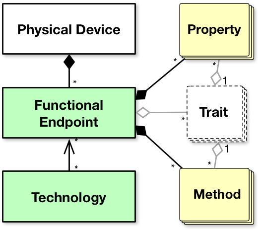

Introduction to the Splot Object Model (SOM)
============================================

The Splot Object Model (SOM) defines an experimental object model for
facilitating the monitoring and control of individual things and
groups of things.

The SOM was designed, to the extent practical, to express a superset of
functionality currently provided by existing IoT protocols in common
use. Meaning, the object model was designed to allow for reasonably
efficient implementations of software that enables devices using
non-SOM-based protocols to be manipulated as if they were, with as few
caveats as possible.

Note that the SOM is just an object model: It defines vocabulary,
concepts, and object relationships. It isn’t software: it’s a
concept.

## Architecture ##

The following objects represent the most important concepts in the
SOM:

*   Functional Endpoint
    *   Property
    *   Method
    *   Trait
*   Technology

## Functional Endpoints ##

*Functional Endpoints* (FEs) are the fundamental control surface
objects. Physical devices *host* one or more functional endpoints.

Some hypothetical examples of functional endpoints and their
relationship to physical devices:

*   A smart light bulb that hosts a single functional endpoint that is
    used to control the state of the light bulb.
*   A smart power strip that hosts one functional endpoint per outlet,
    used to control the state of each outlet and monitor power usage.
*   A proprietary wireless sensor gateway hosting one (or more)
    functional endpoints for each wireless sensor, used to monitor
    temperature and humidity.

Note: The reason the term *Functional Endpoint* was used instead of
*Object* was because the term "Object" was considered too abstract and
general. Also, Splot functional endpoints have structure and
constraints that make them unique, which we will go into further.

Functional endpoints can have:

*   *Properties* that can be monitored, changed, or mutated
*   *Methods* that can be invoked with named arguments and return
    values
*   *Child functional endpoints* which it owns and manages

### Traits ###

Properties, methods, and children are defined by *Traits*. A
functional endpoint can implement properties and methods from several
traits. Children are also scoped to specific traits.

A Trait is a set of properties and methods that are related to a
purpose. For example, the *OnOff trait* provides the concept of being
on or off, whereas the *Level trait* provides the concept of a dimmer
switch or volume knob. These are separate from the *Light trait* which
provides additional properties for correlated color temperature and
sRGB values, but none that are suitable substitutes for the properties
provided by OnOff and Level: the Light trait is designed to be used
alongside these traits. Functional endpoints typically implement
properties from several traits.

Some traits, like the *Scene trait*, define child functional
endpoints. In the case of the Scene trait, each child functional
endpoint represents a scene that can be recalled, modified, or
deleted. A "save" method is also provided by the trait to allow the
current state to be saved to a new or existing scene.

Traits are scoped to be as general as practical so that they can be
applied to many different types of functional endpoints. For example,
the Level trait could be applied to a light bulb to control dimming,
or applied to a ceiling fan to control speed, or to a window
controller to control how far open the window is.

Each trait is defined to have both a human-readable name ("OnOff",
"Level", "Keychain") and a short trait-id ("`onof`", "`levl`",
"`keyc`").

### Properties ###

Properties are the primary way to monitor and control a functional
endpoint. Each property has a value type associated with it which can
be one of the following:

*   Integer
*   Floating-point number
*   Text String
*   Byte String
*   Boolean
*   Array
*   Map

The actual value of a property may be one of these types or `null`,
the meaning of which is outlined by the trait that defines the
property.

Each property has an identifier, which is a short string (typically
four characters long) that uniquely identifies the property with its
scope.

Sections organize properties in a functional endpoint based on their
usage and intended purpose. There are three sections:

*   the *State* section contains properties that monitor and/or
    control the primary function or operational state of the
    functional endpoint.
*   the *Configuration* section contains properties that effect how
    the properties in the state section are interpreted or behave, but
    do not themselves directly monitor or control the primary function
    or operational state of the functional endpoint.
*   the *Metadata* section contains properties that describe the
    functional endpoint, either for the purpose of identification or
    to describe the capabilities fo the functional endpoint. These
    properties have absolutely no direct or indirect effect on the
    operational behavior of the functional endpoint.

Each section is associated with a single character used to identify
the section:

*   "`s`": State
*   "`c`": Configuration
*   "`m`": Metadata

Properties are scoped by *section* and *trait*. The combination of
section letter, trait-id, and property-id, each separated with a slash
("`/`"), define the property key that uniquely identifies a property:

*   `s/onof/v`: On/off state value (boolean)
*   `s/levl/v`: Level value (float)
*   `c/enrg/mxam`: Maximum allowed amps (float)
*   `m/base/name`: Administratively assigned name (String)

Footnote: A convention of using four or fewer letters has been adopted
in order to reduce packet sizes, but this is not a hard rule.
Obviously longer, more descriptive identifiers would improve casual
comprehension, but at the cost of wasted bytes.

Footnote: A formal registry of traits and trait identifiers has not
yet been established.

#### Property Definition Attributes ####

Traits can further describe properties using the following set of
boolean attributes:

*   `GETTABLE`: This property can be readable.
*   `SETTABLE`: This property can be writable.
*   `OBSERVABLE`: Changes to this property's value can be observed.
*   `RESETTABLE`: This property is reset (e.g. a counter) to the same
    value by any write.
*   `GET_REQUIRED`: This property is required to be implemented and
    readable.
*   `SET_REQUIRED`: This property is required to be implemented and
    writable.
*   `VOLATILE`: This property should never be stored and recovered
    from non-volatile memory.
*   `NO_TRANSITION`: This property should never be smoothly
    transitioned between values.
*   `NO_INCREMENT`: This property should never allow itself to be
    incremented.
*   `NO_ADD_REMOVE`: This property should never allow add/remove
    operations.

Additionally, some attributes are defined as combinations of the above
single attributes:

*   `READ_ONLY`: `GETTABLE` | `OBSERVABLE`
*   `READ_WRITE`: `GETTABLE` | `OBSERVABLE` | `SETTABLE`
*   `WRITE_ONLY`: `SETTABLE`
*   `CONSTANT`: `GETTABLE`
*   `ENUM`: `NO_TRANSITION` | `NO_INCREMENT`

A property definition is implied to be optional unless `GET_REQUIRED`
and/or `SET_REQUIRED` are present.

### Methods ###

Methods are a way to manipulate a functional endpoint in ways that
would not translate well to properties. The most common example is for
creating new child functional endpoints, but the mechanism is defined
to be open-ended.

Methods take a named set of arguments as input and are defined to
output a single value or indicate an error. Arguments are identified
by a short string rather than by their order. Arguments and return
values share the same set of value types that are used by properties,
with the addition that a method may return a direct reference to a
child functional endpoint. (This is used to return created or updated
child functional endpoints).

Methods are defined by traits just like properties are. The trait
defines what the named arguments are, what their types should be,
which arguments are required, and what the method return type will be.

Just like properties, methods are scoped by trait. They have a special
section designated "`f`"(This scope gets double-duty in SMCP with also
handling child functional endpoints, but I digress). The scope, trait,
and method identifier are combined similarly to properties, except
that the second slash is instead a question mark:

*   `f/scen?save`: Save current state to a new or existing scene
*   `f/gmgr?create`: Create a new group

#### Method Definition Attributes ####

Like properties, traits can also specify attributes as a part of the
method definition. However, there are relatively few:

*   `REQUIRED`: This method is required to be implemented.
*   `WANTS_GROUP_ID`: If invoked via a group, add the group id to the
    arguments.

### Child Functional Endpoints ###

A trait's definition can indicate if it has child functional
endpoints, and if so how those functional endpoints behave and what
traits the children themselves implement.

For example, the scene trait allows a functional endpoint to save the
values of the properties in its state section and associating that
with a scene-id. The scene itself is represented as a child functional
endpoint that can be manipulated independently.

Each child functional endpoint can be identified by a combination of
the trait identifier and a child-id.

For example, if I used `f/scen?save` to create a scene with a scene-id
(child-id) of `evening`, the resulting child would be identified by
the tuple (`scen`, `evening`).

The exact mechanism for how you reference children is implementation
specific, but in SMCP for example, it would be referenced as
`f/scen/evening/`, relative to the parent.

The nesting of child functional endpoints is allowed.

## Technologies ##

Technologies are objects that allow you to:

*   Discover new functional endpoints
*   Host functional endpoints for other devices to use
*   Managing groups and automation primitives

Whereas functional endpoints were objects that you directly interact
with using an IoT protocol, a technology object represents the actual
implementation of that protocol.

In the SOM, technologies are considered separate from the functional
endpoints that they provide or host. For example, Let's say we had a
technology instance (SmcpTechnology) which enables us to use
functional endpoints that are hosted using SMCP on other devices as
well as enabling us to host our own functional endpoints for other
devices to use.

To host a functional endpoint for other devices to use, you simply
command the technology to host a given functional endpoint instance.
Before that moment, the two objects were entirely unrelated. The key
point is that it doesn't matter where that functional endpoint
instance came from: it could be a locally created functional endpoint
or it could be a functional endpoint that was discovered by a
different technology.

Taking a functional endpoint that is native-to (discovered-using) one
technology and then hosting that on a separate technology is called
"bridging".

The relationship between any given functional endpoint and a given
technology can be described by one of the following terms: *native*,
*hosted*, or *unrelated*:

*   A **native** functional endpoint is owned and managed entirely
    within a technology, and often represents functionality which is
    implemented on a different device.
*   A **hosted** functional endpoint is not owned or managed by the
    technology. Instead, the technology "hosts" the functionality of
    the functional endpoint for other devices to use.
*   An **unrelated** functional endpoint has no relationship with the
    technology. Such a functional endpoint cannot be used by the
    technology or participate in groups hosted by the technology.

If a functional endpoint is either hosted-by or native-to a
technology, it is said to be "associated" with that technology.

In most cases, a functional endpoint is described by only one of the
above three labels. However, functional endpoints representing groups
are *always* native to a Technology, but are are often also hosted by
the same Technology. This is because groups logically exist on more
than one device, so they can be both native and (if any hosted
functional endpoints are members) hosted.

## Groups ##

A group is a collection of functional endpoints (members) which can be
controlled as a single functional endpoint. Groups are always owned by
a technology. Members of a group must be associated with that group's
technology.

The state section of a group functional endpoint is special in that
any operation performed on properties in the state section will be
applied to those properties on all of the group's members.

By comparison, the configuration and metadata sections belong to the
group itself. Thus, it is not possible to change a configuration or
metadata property across the members of a group in a single operation
like you can with state properties.

The behavior of reading state properties on a group is currently
undefined by the SOM and thus the behavior is technology-specific.
This may change at some point.
